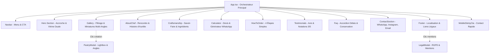

# 🍰 L'Atelier d'Aurélie — Site Vitrine Haute Pâtisserie Artisanale

[](https://github.com/Boblebol/atelier-patisserie/actions)
[](LICENSE)
[](https://react.dev)
[](https://vitejs.dev)
[](https://tailwindcss.com)
[](https://www.typescriptlang.org)

Site vitrine élégant et haute performance dédié à la mise en valeur des créations d'**Aurélie**, pâtissière autodidacte et passionnée depuis des années : entremets miroir, drip cakes personnalisés, layer cakes d'anniversaire et pièces festives sur mesure.

---

## ✨ Points Forts & Fonctionnalités

- 👩‍🍳 **L'Histoire & la Passion d'Aurélie** :
  - Section dédiée présentant le parcours autodidacte d'Aurélie, sa quête du geste parfait et sa philosophie du goût.
  - Signature manuscrite et valeurs artisanales (100% fait main, fraîcheur absolue, écoute attentive).
- 📸 **Galerie Interactive Multi-Angles & Lightbox Haute Résolution** :
  - **L'Écrin Miroir Fruits Rouges & Figues** (vue dessus, profil, coupe 3/4, zoom macro glaçage miroir, boîte de livraison).
  - **Le Drip Cake Céleste Kinder Bueno & Chocolat** (face majestueuse, vue dessus avec couronne pochée ganache, gros plan 34 ans).
- 🧮 **Simulateur de Devis & Calculateur de Parts en Direct** :
  - Choix du type de gâteau (Entremets miroir, Drip cake, Création sur mesure).
  - Sélection du nombre de parts (6 à 25+ parts) avec calcul transparent du budget.
  - Choix des profils aromatiques et personnalisation (inscription caramel/chocolat, âge, thème).
  - **Génération automatique d'un message WhatsApp pré-rempli pour Aurélie en 1 clic** avec récapitulatif complet de la demande.
- 📱 **Mobile-First & Sticky CTA** :
  - Barre d'action sticky mobile pour commander ou contacter l'atelier sur WhatsApp sans friction.
  - Navigation fluide avec tiroir mobile et backdrop-blur.
- 🌿 **Design & Direction Artistique Pâtissière** :
  - Palette chaleureuse et raffinée : crème vanille (`#FAF8F5`), chocolat noir (`#2F160A`), baies rouges (`#D64368`) et touches d'or chaud (`#D4B072`).
  - Typographie soignée combinant la noblesse du serif (*Cormorant Garamond*), la clarté moderne (*Plus Jakarta Sans*) et la délicatesse d'une calligraphie signature (*Alex Brush*).
- 🔍 **SEO & Performance Optimale** :
  - Images converties en **WebP** haute qualité avec fallbacks.
  - Balises Open Graph & Twitter Cards avec visuel social 1200x630px.
  - Données structurées **Schema.org** (`Bakery` / `LocalBusiness` avec fondateur).
  - `robots.txt` et `sitemap.xml` conformes.
- ⚖️ **Conformité Légale & Transparence** :
  - Modal intégrée des mentions légales et de politique de confidentialité RGPD.
  - Conseils de conservation, transport et traçabilité des allergènes.

---

## 🏗️ Architecture du Projet



---

## 🛠️ Personnalisation Facile

Toutes les coordonnées, textes, parfums et créations sont centralisés dans un fichier unique :

📂 [**`src/config/site.ts`**](src/config/site.ts)

Pour adapter le site au nom de la cheffe, il suffit de modifier :
```typescript
export const siteConfig = {
  name: "L'Atelier Pâtisserie",           // Nom de sa marque ou son prénom
  chefTitle: "Cheffe Pâtissière",
  location: "Paris & Île-de-France",     // Ville ou atelier
  phone: "+33 6 00 00 00 00",            // Numéro d'appel
  whatsappNumber: "33600000000",         // Numéro WhatsApp direct
  instagramHandle: "patisserie.art",     // Identifiant Instagram
  instagramUrl: "https://instagram.com",
  email: "contact@latelier-patisserie.fr",
  // ...
};
```

---

## 🚀 Démarrage Rapide

### Prérequis
- Node.js >= 18
- pnpm (recommandé) ou npm

### Installation & Lancement
```bash
# Cloner le dépôt
git clone git@github.com:Boblebol/atelier-patisserie.git
cd atelier-patisserie

# Installer les dépendances
pnpm install

# Démarrer le serveur de développement local
pnpm dev
# -> Disponible sur http://localhost:5173

# Compiler pour la production (TypeScript + Vite)
pnpm build

# Prévisualiser la version de production
pnpm preview
```

---

## 📦 Déploiement

Le projet produit un bundle statique autonome dans `dist/`, immédiatement déployable sur :
- **Netlify** : `dist` comme publish directory, build command `pnpm build`
- **Vercel** : Détection automatique Vite
- **Cloudflare Pages** : Build command `pnpm build`, Output directory `dist`
- **GitHub Pages** : Déploiement automatisé via GitHub Actions

---

## 📄 Licence

Projet distribué sous licence [MIT](LICENSE).
Créations photographiques et recettes pâtissières réservées à leur créatrice.
